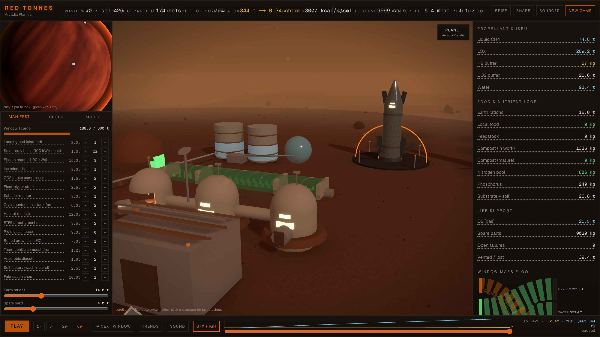
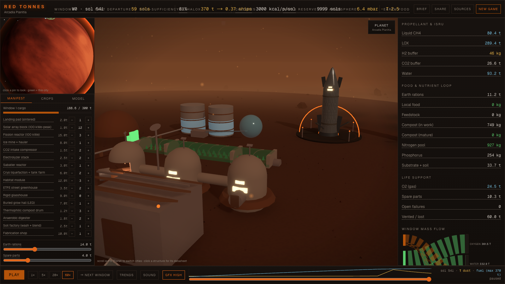

# RED TONNES

**Play it now: [fishygeek91.github.io/red-tonnes](https://fishygeek91.github.io/red-tonnes/)**

A first-principles Mars city simulator. Not "paint Mars green" — a living
mass/energy/time model of how a red planet grows a city that can feed people,
close its waste loops, and fuel its own Starships, while the sky stays thin.

- **Unit of account:** landed tonnes, kWe, kilograms of water/C/N/P, sols, and
  Earth–Mars synodic windows (~26 months / 759 sols).
- **Starship is the currency.** Every import is paid in cargo landings.
- **ISRU is the bottleneck.** Ice + 6 mbar CO2 → water, O2, CH4/LOX via
  electrolysis and Sabatier, with honest thin-air compression energy.
- **Food and waste are first-class.** Greenhouses, thermophilic compost drums,
  anaerobic digesters, urine N recovery, a perchlorate-washing soil factory.
- **Terraforming is an overlay that fails on purpose** (Jakosky & Edwards
  2018): accessible CO2 tops out near 20 mbar. The city para-terraforms;
  Mars stays red.

A clear sol — Starships on the pads, greenhouses glowing, ISRU humming.
Ship traffic is real: arrivals descend on landing burns when a window opens,
and a fueled ship climbs out at the departure sol:



Then the global dust storm hits (τ 4.3): solar collapses, the city dims to
its nuclear floor, and ISRU turns down while life support holds:



## Install & run

```bash
npm install
npm run dev
# open http://localhost:3000
```

No backend, no auth, no analytics, no AI calls. Everything runs locally.

## How the sim steps

The engine is a single pure function:

```
step(state, dtSols, actions) => nextState   // src/lib/sim/step.ts
```

- The UI (Zustand store in `src/store/useSimStore.ts`) only renders state and
  dispatches actions; it never touches physics.
- Deterministic: same seed + same inputs ⇒ same history (mulberry32 RNG,
  storm years hashed from the seed).
- One tick = one sol. Per sol, in order: dust optical depth → power supply
  (solar derated by τ, latitude, and failures; nuclear immune) → demand tiers
  (life support first, fabrication last) → greenhouse growth (light × media ×
  N/P × CO2) → human metabolism and wastes → compost/digester batches (70-sol
  and 25-sol cycles) → soil factory → ISRU chain (ice mine → CO2 intake →
  Sabatier → LOX → electrolysis) → boil-off and H2 leaks → Weibull-ish
  failures → window logistics (arrivals every 759 sols, departure burns at
  +600) → end-state checks.
- **Mass closes.** Every kilogram is in an inventory pool, a structure, on a
  departed ship, or logged in `ventedKg`. Water is conserved through biomass:
  fresh tissue locks water out of the tank, and it only returns when the food
  is eaten or the compost matures — a lush greenhouse street can genuinely
  starve the electrolyzers. If you change a flow, keep the books closed —
  simplify the 3D before you ever simplify conservation.
- Failures are weighted by hardware type (ETFE films and dust-eating miners
  fail ~3× the fleet baseline), crew maintenance hours are a real constraint,
  and a breathing-gas shortfall taps the LOX farm before anyone suffocates.
- Keyboard: **space** = play/pause, **N** = jump to next window.
- Click any structure in the city for its live datasheet — output, bottleneck,
  and failure hazard, computed with the engine's own formulas. **Trends**
  opens six scrubbable history charts, and dragging the timeline replays the
  whole city: dust, tank fills, and Starship traffic included.
- **Ghost racing.** Open someone's share link and hit **Race the ghost**:
  the same seed restarts from sol 0 with their run frozen as a ghost — same
  storms, same windows, your decisions. The HUD tracks fuel, loop closure,
  and how many sols ahead or behind you are; their milestones pop as toasts
  when your clock crosses them, and their runs draw as dashed lines on the
  Methalox and Loop charts. The final scorecard prints the race verdict.
  No backend: the ghost is derived entirely from the permalink's replay.

## Where the constants live

`src/lib/constants.ts` — one audited file. Every number is either cited
(NASA fact sheet, BVAD, Wheeler 2017, Hecht 2009, Jakosky & Edwards 2018,
EPA compost handbooks) or labeled `ASSUMED:` with the reasoning. The
load-bearing assumptions (Starship payload class, methalox per ship, ships
per window) are sliders in the Model tab. The in-app **Sources** drawer is
the same list, abridged.

Other data: `src/lib/sites.ts` (preset sites + dust-storm τ series),
`src/lib/crops.ts` (the honest six-crop set), `src/lib/structures.ts`
(buildables + the industry tier ladder, unlocked by tonnes of local output).

## How to demo this in 90 seconds

Load the page — the demo (seed 7, Arcadia Planitia, "Balanced 12-crew") plays
itself at 20 sols/second. Watch the top bar: two Starships are down, the ice
mine fills the water tank, and methalox starts climbing. Around sol 420 a
global dust storm hits — the τ sparkline spikes, solar collapses, greenhouse
glow dims, and the nuclear floor carries life support while ISRU turns down.
At sol 759, window 1 lands more plant; compost batches mature and the nitrogen
pool climbs as the loop closes; Earth-food fraction falls to zero. By sol
~1120 the tanks hit 1,000 t and **RETURN FUEL READY** fires; at sol 1359 a
ship burns for home on local propellant. Click **Brief** to copy the
mission-brief markdown, then open **Sources** to show the receipts. To show a
failure instead, start a New Game with the "Food first" manifest and watch the
departure window get missed.

## Verify the engine headlessly

```bash
npx tsx scripts/smoke.ts
```

Runs two windows, checks determinism and that no pool goes non-finite,
verifies the share codec and ghost-racing helpers, and prints the mission
brief. `npx tsx scripts/verify-ghost.ts` drives a real browser through a
shared link and a ghost race (needs `npm run dev` or `next start` running).
